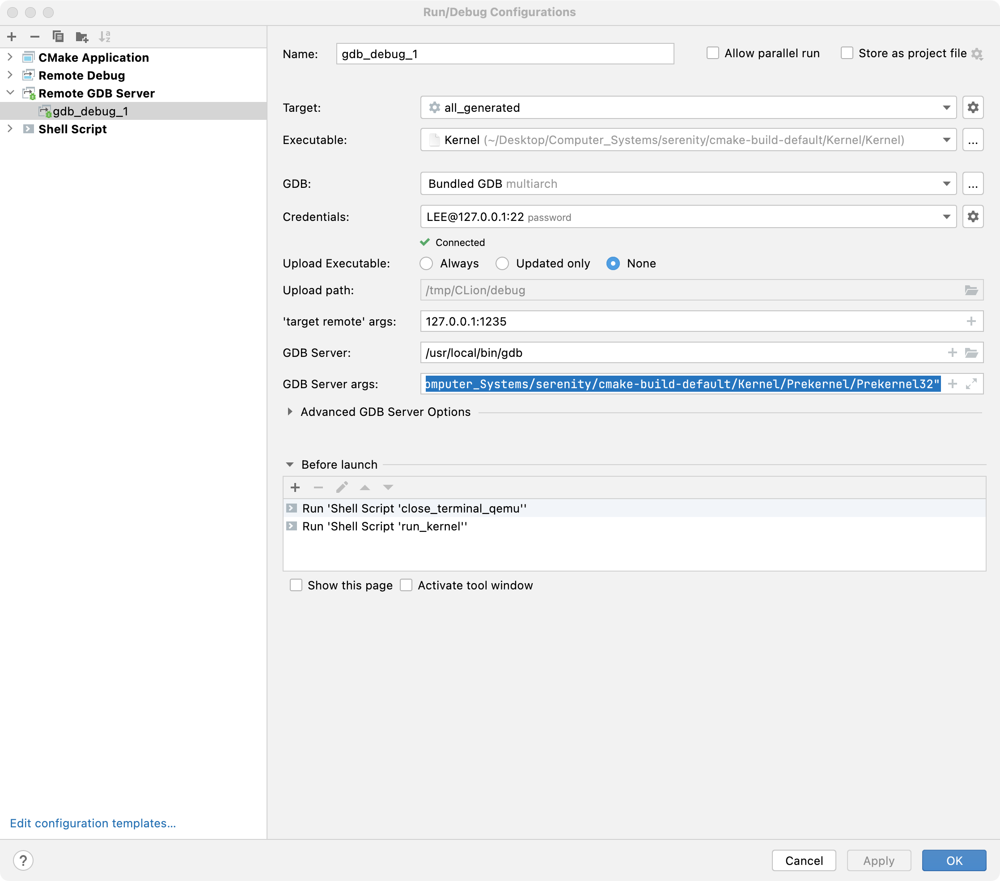
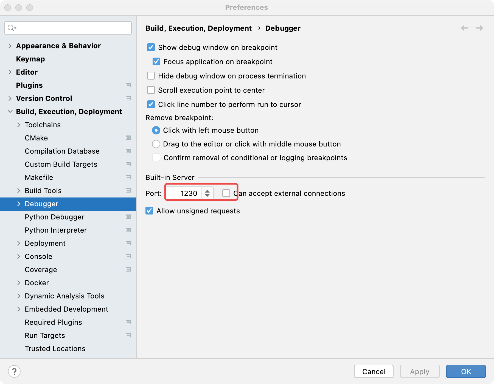
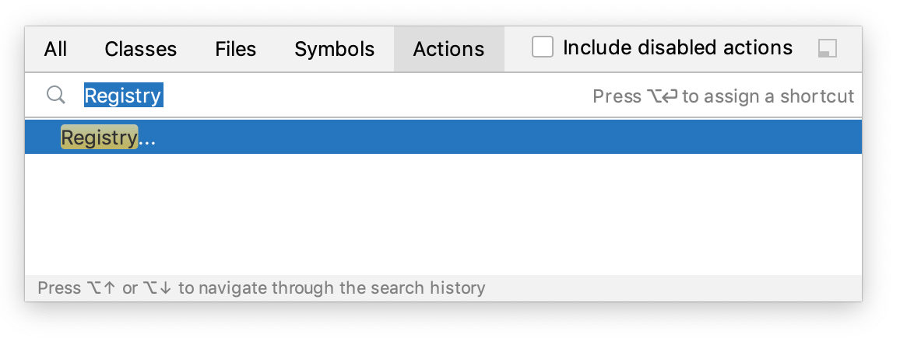
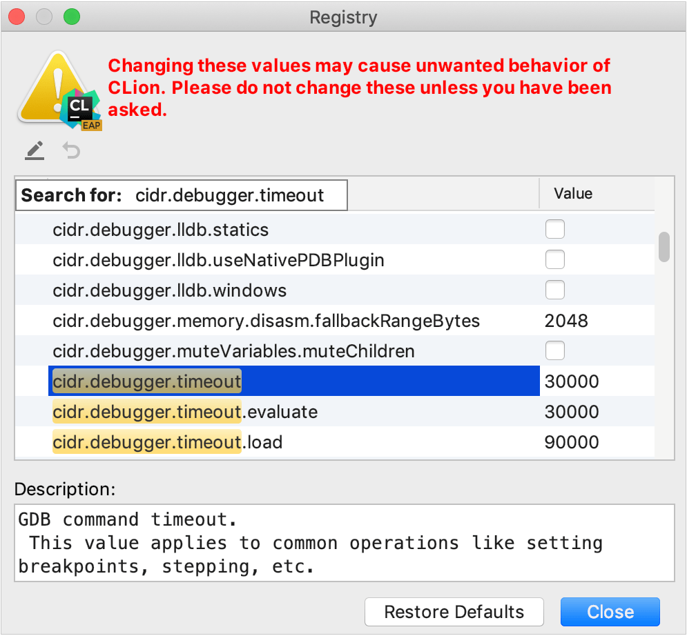

# SerenityOS

Graphical Unix-like operating system for x86 computers.

[](https://github.com/SerenityOS/serenity/actions?query=workflow%3A"Build%2C%20lint%2C%20and%20test")
[](https://dev.azure.com/SerenityOS/SerenityOS/_build/latest?definitionId=1&branchName=master)
[](https://bugs.chromium.org/p/oss-fuzz/issues/list?sort=-opened&can=1&q=proj:serenity)
[](https://sonarcloud.io/dashboard?id=SerenityOS_serenity)
[](https://discord.gg/serenityos)

## About

SerenityOS is a love letter to '90s user interfaces with a custom Unix-like core. It flatters with sincerity by stealing beautiful ideas from various other systems.

Roughly speaking, the goal is a marriage between the aesthetic of late-1990s productivity software and the power-user accessibility of late-2000s \*nix. This is a system by us, for us, based on the things we like.

You can watch videos of the system being developed on YouTube:

* [Andreas Kling's channel](https://youtube.com/andreaskling)
* [Linus Groh's channel](https://youtube.com/linusgroh)
* [kleines Filmröllchen's channel](https://www.youtube.com/c/kleinesfilmroellchen)

**FAQ**: [Frequently Asked Questions](https://github.com/SerenityOS/serenity/blob/master/Documentation/FAQ.md)

## Screenshot


## Features

* Modern x86 32-bit and 64-bit kernel with pre-emptive multi-threading
* [Browser](Userland/Applications/Browser/) with JavaScript, WebAssembly, and more (check the spec compliance for [JS](https://libjs.dev/test262/), [CSS](https://css.tobyase.de/), and [WASM](https://libjs.dev/wasm/))
* Security features (hardware protections, limited userland capabilities, W^X memory, `pledge` & `unveil`, (K)ASLR, OOM-resistance, web-content isolation, state-of-the-art TLS algorithms, ...)
* [System services](Userland/Services/) (WindowServer, LoginServer, AudioServer, WebServer, RequestServer, CrashServer, ...) and modern IPC
* Good POSIX compatibility ([LibC](Userland/Libraries/LibC/), Shell, syscalls, signals, pseudoterminals, filesystem notifications, standard Unix [utilities](Userland/Utilities/), ...)
* POSIX-like virtual file systems (/proc, /dev, /sys, /tmp, ...) and ext2 file system
* Network stack and applications with support for IPv4, TCP, UDP; DNS, HTTP, Gemini, IMAP, NTP
* Profiling, debugging and other development tools (Kernel-supported profiling, detailed program analysis with software emulation in UserspaceEmulator, CrashReporter, interactive GUI playground, HexEditor, HackStudio IDE for C++ and more)
* [Libraries](Userland/Libraries/) for everything from cryptography to OpenGL, audio, JavaScript, GUI, playing chess, ...
* Support for many common and uncommon file formats (PNG, JPEG, GIF, MP3, WAV, FLAC, ZIP, TAR, PDF, QOI, Gemini, ...)
* Unified style and design philosophy, flexible theming system, [custom (bitmap and vector) fonts](https://fonts.serenityos.net/font-family)
* [Games](Userland/Games/) (Solitaire, Minesweeper, 2048, chess, Conway's Game of Life, ...) and [demos](Userland/Demos/) (CatDog, Starfield, Eyes, mandelbrot set, WidgetGallery, ...)
* Every-day GUI programs and utilities (Spreadsheet with JavaScript, TextEditor, Terminal, PixelPaint, various multimedia viewers and players, Mail, Assistant, Calculator, ...)

... and all of the above are right in this repository, no extra dependencies, built from-scratch by us :^)

Additionally, there are [over two hundred ports of popular open-source software](Ports/AvailablePorts.md), including games, compilers, Unix tools, multimedia apps and more.

## How do I read the documentation?

Man pages are available online at [man.serenityos.org](https://man.serenityos.org). These pages are generated from the Markdown source files in [`Base/usr/share/man`](https://github.com/SerenityOS/serenity/tree/master/Base/usr/share/man) and updated automatically.

When running SerenityOS you can use `man` for the terminal interface, or `help` for the GUI.

Code-related documentation can be found in the [documentation](Documentation/) folder.

## How do I build and run this?

See the [SerenityOS build instructions](https://github.com/SerenityOS/serenity/blob/master/Documentation/BuildInstructions.md). Serenity runs on Linux, macOS (aarch64 might be a challenge), Windows (with WSL2) and many other *Nixes with hardware or software virtualization.

## Get in touch and participate!

Join our Discord server: [SerenityOS Discord](https://discord.gg/serenityos)

Before opening an issue, please see the [issue policy](https://github.com/SerenityOS/serenity/blob/master/CONTRIBUTING.md#issue-policy).

A general guide for contributing can be found in [`CONTRIBUTING.md`](CONTRIBUTING.md).

## Authors

* **Andreas Kling** - [awesomekling](https://twitter.com/awesomekling) [](https://github.com/sponsors/awesomekling)
* **Robin Burchell** - [rburchell](https://github.com/rburchell)
* **Conrad Pankoff** - [deoxxa](https://github.com/deoxxa)
* **Sergey Bugaev** - [bugaevc](https://github.com/bugaevc)
* **Liav A** - [supercomputer7](https://github.com/supercomputer7)
* **Linus Groh** - [linusg](https://github.com/linusg) [](https://github.com/sponsors/linusg)
* **Ali Mohammad Pur** - [alimpfard](https://github.com/alimpfard)
* **Shannon Booth** - [shannonbooth](https://github.com/shannonbooth)
* **Hüseyin ASLITÜRK** - [asliturk](https://github.com/asliturk)
* **Matthew Olsson** - [mattco98](https://github.com/mattco98)
* **Nico Weber** - [nico](https://github.com/nico)
* **Brian Gianforcaro** - [bgianfo](https://github.com/bgianfo)
* **Ben Wiederhake** - [BenWiederhake](https://github.com/BenWiederhake)
* **Tom** - [tomuta](https://github.com/tomuta)
* **Paul Scharnofske** - [asynts](https://github.com/asynts)
* **Itamar Shenhar** - [itamar8910](https://github.com/itamar8910)
* **Luke Wilde** - [Lubrsi](https://github.com/Lubrsi)
* **Brendan Coles** - [bcoles](https://github.com/bcoles)
* **Andrew Kaster** - [ADKaster](https://github.com/ADKaster)
* **thankyouverycool** - [thankyouverycool](https://github.com/thankyouverycool)
* **Idan Horowitz** - [IdanHo](https://github.com/IdanHo)
* **Gunnar Beutner** - [gunnarbeutner](https://github.com/gunnarbeutner)
* **Tim Flynn** - [trflynn89](https://github.com/trflynn89)
* **Jean-Baptiste Boric** - [boricj](https://github.com/boricj)
* **Stephan Unverwerth** - [sunverwerth](https://github.com/sunverwerth)
* **Max Wipfli** - [MaxWipfli](https://github.com/MaxWipfli)
* **Daniel Bertalan** - [BertalanD](https://github.com/BertalanD)
* **Jelle Raaijmakers** - [GMTA](https://github.com/GMTA)
* **Sam Atkins** - [AtkinsSJ](https://github.com/AtkinsSJ) [](https://github.com/sponsors/AtkinsSJ)
* **Tobias Christiansen** - [TobyAsE](https://github.com/TobyAsE)
* **Lenny Maiorani** - [ldm5180](https://github.com/ldm5180)
* **sin-ack** - [sin-ack](https://github.com/sin-ack)
* **Jesse Buhagiar** - [Quaker762](https://github.com/Quaker762)
* **Peter Elliott** - [Petelliott](https://github.com/Petelliott)
* **Karol Kosek** - [krkk](https://github.com/krkk)
* **Mustafa Quraish** - [mustafaquraish](https://github.com/mustafaquraish)
* **David Tuin** - [davidot](https://github.com/davidot)
* **Leon Albrecht** - [Hendiadyoin1](https://github.com/Hendiadyoin1)
* **Tim Schumacher** - [timschumi](https://github.com/timschumi)
* **Marcus Nilsson** - [metmo](https://github.com/metmo)
* **Gegga Thor** - [Xexxa](https://github.com/Xexxa) [](https://github.com/sponsors/Xexxa)
* **kleines Filmröllchen** - [kleinesfilmroellchen](https://github.com/kleinesfilmroellchen) [](https://github.com/sponsors/kleinesfilmroellchen)
* **Kenneth Myhra** - [kennethmyhra](https://github.com/kennethmyhra)
* **Maciej** - [sppmacd](https://github.com/sppmacd)
* **Sahan Fernando** - [ccapitalK](https://github.com/ccapitalK)
* **Benjamin Maxwell** - [MacDue](https://github.com/MacDue)
* **Dennis Esternon** - [djwisdom](https://github.com/djwisdom) [](https://github.com/sponsors/djwisdom)
* **frhun** - [frhun](https://github.com/frhun)
* **networkException** - [networkException](https://github.com/networkException) [](https://github.com/sponsors/networkException)
* **Brandon Jordan** - [electrikmilk](https://github.com/electrikmilk)
* **Lucas Chollet** - [LucasChollet](https://github.com/LucasChollet)
* **Timon Kruiper** - [FireFox317](https://github.com/FireFox317)

And many more! [See here](https://github.com/SerenityOS/serenity/graphs/contributors) for a full contributor list. The people listed above have landed more than 100 commits in the project. :^)

## License

SerenityOS is licensed under a 2-clause BSD license.


## macos Usage:

### 1.ninja setup-and-run

this use for build image and run,

in clion configurations select application and show all ninja list


```

osascript -e 'tell application "Terminal" to activate'  -e 'tell application "Terminal" to do script "cd /Users/lee/Desktop/Computer_Systems/serenity/cmake-build-default \n echo lh1992524 | sudo -S ninja setup-and-run  " in selected tab of the front window'

```


### 2.使用  `qemu-system-i386 -s -S -kernel Prekernel` +  `lldb Prekernel` 进行调试


### 3.编译的优化和调试信息
#### 1.添加 -O2 编译优化
add_compile_options(-O2)
#### 2.添加 -g1 会使 qemu-system-i386 调试 .cpp 文件失败
add_compile_options(-g1)

### 4.solve the 'version () does not match expected compiler version (14.0.1).'
CMake Error at CMakeLists.txt:23 (message):
   version () does not match expected compiler version (14.0.1).

  Please rebuild the Toolchain

  1. Build/superbuild-i686
  2. Meta/serenity.sh run


### 4.clion gdb 搭配

#### 4.1
gdbserver args:

```
-ex "set arch i386:intel" -ex "show remotetimeout" -ex "set remotetimeout 15000" -ex "show remotetimeout" -ex "set confirm off" -ex "add-symbol-file /Users/lee/Desktop/Computer_Systems/serenity/Meta/../cmake-build-default/Kernel/Kernel -o 0xc0200000" -ex "--eval-command=\"shell sleep 5\"" -ex "file /Users/lee/Desktop/Computer_Systems/serenity/cmake-build-default/Kernel/Prekernel/Prekernel32" 

```


```

-ex "set arch i386:intel" -ex "set confirm off" -ex "add-symbol-file /Users/lee/Desktop/Computer_Systems/serenity/cmake-build-default/Kernel/Prekernel/Prekernel32" -ex "file /Users/lee/Desktop/Computer_Systems/serenity/Meta/../cmake-build-default/Kernel/Kernel -o 0xc0200000" -ex "source /Users/lee/Desktop/Computer_Systems/serenity/Meta/serenity_gdb.py" -ex "shell sleep 5"

```





#### 4.2 修改 Clion 默认端口号 1234 -》 1230





#### 4.3 显示gdb 加载的符号

```

info files

```

### 5.关于图形窗口 WindowServer

#### 5.1 写入方法为 ErrorOr<void> HardwareScreenBackend::write_all_contents(Gfx::IntRect const& virtual_rect)

m_framebuffer_fd 句柄为 10

#### 5.2 记录配置

-GNinja -DDYNAMIC_LOAD_DEBUG=ON -DENABLE_EXTRA_KERNEL_DEBUG_SYMBOLS=ON -DCMAKE_TOOLCHAIN_FILE=$CMakeProjectDir$/Build/i686/CMakeToolchain.txt -DCMAKE_PREFIX_PATH=$CMakeProjectDir$/Build/lagom-install -DSERENITY_ARCH=i686


#### 5.3 关于 windowServer 创建 Messages::WindowServer::MessageID::CreateMenu: 消息的过程

1.SytemServer 创建 Terminal 应用  可以从 /Users/lee/Desktop/Computer_Systems/serenity/Base/home/anon/.config/SystemServer.ini 文件中看到；

2.Terminal 使用 ErrorOr<NonnullOwnPtr<LocalSocket>> LocalSocket::connect(String const& path) 创建一个本地连接和 windowServer 中的     m_window_server = MUST(IPC::MultiServer<ConnectionFromClient>::try_create("/tmp/portal/window")); 进行链接；

3.连接完成后，即accept以后创建一个新的connection，其socketid = accept 返回的 22（例子），    

```

ErrorOr<NonnullOwnPtr<Stream::LocalSocket>> LocalServer::accept()
{
    VERIFY(m_listening);
    sockaddr_un un;
    socklen_t un_size = sizeof(un);
#ifndef AK_OS_MACOS
    int accepted_fd = ::accept4(m_fd, (sockaddr*)&un, &un_size, SOCK_NONBLOCK | SOCK_CLOEXEC);
    dbgln("LocalServer::accept:this:{},m_fd:{},accepted_fd:{}",this,m_fd,accepted_fd);
#else
    int accepted_fd = ::accept(m_fd, (sockaddr*)&un, &un_size);
#endif
    if (accepted_fd < 0) {
        return Error::from_syscall("accept"sv, -errno);
    }

#ifdef AK_OS_MACOS
    int option = 1;
    ioctl(m_fd, FIONBIO, &option);
    (void)fcntl(accepted_fd, F_SETFD, FD_CLOEXEC);
#endif

    return Stream::LocalSocket::adopt_fd(accepted_fd);
}

    m_server->on_accept = [&](auto client_socket) {
            auto client_id = ++m_next_client_id;
            (void)IPC::new_client_connection<ConnectionFromClientType>(move(client_socket), client_id);
        };
```
4.创建 client_socket 时会设置好 通知，加入 当前线中的 static thread_local HashTable<Notifier*>* s_notifiers; 中，等待message

```
ErrorOr<NonnullOwnPtr<LocalSocket>> LocalSocket::adopt_fd(int fd)
{
    if (fd < 0) {
        return Error::from_errno(EBADF);
    }

    auto socket = TRY(adopt_nonnull_own_or_enomem(new (nothrow) LocalSocket()));
    socket->m_helper.set_fd(fd);
    socket->setup_notifier();
    return socket;
}

void PosixSocketHelper::setup_notifier()
{
    if (!m_notifier)
        m_notifier = Core::Notifier::construct(m_fd, Core::Notifier::Read);
}

Notifier::Notifier(int fd, unsigned event_mask, Object* parent)
    : Object(parent)
    , m_fd(fd)
    , m_event_mask(event_mask)
{
    set_enabled(true);
}

void Notifier::set_enabled(bool enabled)
{
    if (m_fd < 0)
        return;
    if (enabled)
        Core::EventLoop::register_notifier({}, *this);
    else
        Core::EventLoop::unregister_notifier({}, *this);
}

```

5.Terminal 应用发送  #2  0x06677ed1 in WindowServerProxy<WindowClientEndpoint, WindowServerEndpoint>::async_create_menu (this=0x41904d0, menu_id=1976194937, menu_title=...) at ./cmake-build-default/Userland/Services/WindowServer/WindowServerEndpoint.h:8721 消息；

6.eventLoop接收到 Notifier 消息可读，通知 ConnectionFromClient 进行读取

```

    ConnectionFromClient(ServerStub& stub, NonnullOwnPtr<Core::Stream::LocalSocket> socket, int client_id)
        : IPC::Connection<ServerEndpoint, ClientEndpoint>(stub, move(socket))
        , ClientEndpoint::template Proxy<ServerEndpoint>(*this, {})
        , m_client_id(client_id)
    {
        VERIFY(this->socket().is_open());
        this->socket().on_ready_to_read = [this] {
            // FIXME: Do something about errors.
            (void)this->drain_messages_from_peer();
        };
    }

ErrorOr<void> ConnectionBase::drain_messages_from_peer()
{
    auto bytes = TRY(read_as_much_as_possible_from_socket_without_blocking());

    size_t index = 0;
    try_parse_messages(bytes, index);

    if (index < bytes.size()) {
        // Sometimes we might receive a partial message. That's okay, just stash away
        // the unprocessed bytes and we'll prepend them to the next incoming message
        // in the next run of this function.
        auto remaining_bytes = TRY(ByteBuffer::copy(bytes.span().slice(index)));
        if (!m_unprocessed_bytes.is_empty()) {
            shutdown();
            return Error::from_string_literal("drain_messages_from_peer: Already have unprocessed bytes");
        }
        m_unprocessed_bytes = move(remaining_bytes);
    }

    if (!m_unprocessed_messages.is_empty()) {
        m_deferred_invoker->schedule([strong_this = NonnullRefPtr(*this)]() mutable {
            strong_this->handle_messages();
        });
    }
    return {};
}

void ConnectionBase::handle_messages()
{
    auto messages = move(m_unprocessed_messages);
    for (auto& message : messages) {
        if (message.endpoint_magic() == m_local_endpoint_magic) {
            if (auto response = m_local_stub.handle(message)) {
                if (auto result = post_message(*response); result.is_error()) {
                    dbgln("IPC::ConnectionBase::handle_messages: {}", result.error());
                }
            }
        }
    }
}

    virtual void try_parse_messages(Vector<u8> const& bytes, size_t& index) override
    {
        u32 message_size = 0;
        for (; index + sizeof(message_size) < bytes.size(); index += message_size) {
            memcpy(&message_size, bytes.data() + index, sizeof(message_size));
            if (message_size == 0 || bytes.size() - index - sizeof(uint32_t) < message_size)
                break;
            index += sizeof(message_size);
            auto remaining_bytes = ReadonlyBytes { bytes.data() + index, message_size };
            if (auto message = LocalEndpoint::decode_message(remaining_bytes, fd_passing_socket())) {
                m_unprocessed_messages.append(message.release_nonnull());
            } else if (auto message = PeerEndpoint::decode_message(remaining_bytes, fd_passing_socket())) {
                m_unprocessed_messages.append(message.release_nonnull());
            } else {
                dbgln("Failed to parse a message");
                break;
            }
        }
    }


```


7.if (auto message = LocalEndpoint::decode_message(remaining_bytes, fd_passing_socket())) { 对消息进行解析
 
```

 static OwnPtr<IPC::Message> decode_message(ReadonlyBytes buffer, [[maybe_unused]] Core::Stream::LocalSocket& socket)
    {
        InputMemoryStream stream { buffer };
        u32 message_endpoint_magic = 0;
        stream >> message_endpoint_magic;
        if (stream.handle_any_error()) {

            return {};
        }

        if (message_endpoint_magic != 2938215075) {

            return {};
        }

        i32 message_id = 0;
        stream >> message_id;
        if (stream.handle_any_error()) {

            return {};
        }

        OwnPtr<IPC::Message> message;
        switch (message_id) {

        case (int)Messages::WindowServer::MessageID::CreateMenu:
            message = Messages::WindowServer::CreateMenu::decode(stream, socket);
            break;

}
```


### 6.gdb调试

#### 

```
Process::do_exec,m_name:SystemServer,(16557000),.entry_eip(1655cb99):

```
地址0x16557000并不是SystemServer的offset，而是 Loader.so 的offset

需要再gdb中执行如下操作，然后跳转到 _start、_entry中再次获取SystemServer的真实地址

```
add-symbol-file /Users/lee/Desktop/Computer_Systems/serenity/cmake-build-default/Root/usr/lib/Loader.so -o 0x16557000

```

```

11.681 SystemServer(6:6): linker_main,name:/bin/SystemServer,base_address: 0x1531a000
11.707 SystemServer(6:6): Jumping to entry point: 0x15320850


```

gdb中执行如下操作

```

add-symbol-file /Users/lee/Desktop/Computer_Systems/serenity/cmake-build-default/Root/bin/SystemServer -o 0x1531a000

```

才可以正确加载用户程序的调试信息，进行调试SystemServer程序

### 6.Evaluation hung: add-symbol-file /Users/lee/Desktop/Computer_Systems/serenity/cmake-build-default/Kernel/Kernel -o 0xc0200000 This may be caused by something like a deadlock or an infinite loop. To prevent this from happening when variables are calculated, please toggle 'Enable value renderers' off.


（ctrl + shift + a） and typing "registry" and then enter. And then adjusting the "cidr.debugger.timeout.eveluate" setting to a larger，默认是30000ms（30s），可调大（ref：detail）


https://www.jetbrains.com/help/clion/configuring-debugger-options.html#gdb-startup

You can control the GDB timeout values by setting the corresponding properties in CLion registry.

Press ⇧ ⌘ A or choose Help | Find Action from the main menu. In the popup that opens, start typing Registry, select the corresponding item and press ⏎.



In the dialog that opens, start typing cidr.debugger.timeout. Click the Value field of the highlighted string and enter the timeout value in milliseconds.





### lldb调试

#### 1.设置target

lldb /Users/lee/Desktop/Computer_Systems/serenity/Build/i686/Kernel/Kernel

#### 2.添加符号文件

 target modules load --file /Users/lee/Desktop/Computer_Systems/serenity/Build/i686/Kernel/Kernel --slide  0xc0200000


### 7.windowServer

#### 7.1 任务栏

任务栏是由 

```

TaskbarWindow::TaskbarWindow(NonnullRefPtr<GUI::Menu> start_menu)
    : m_start_menu(move(start_menu))
{
    set_window_type(GUI::WindowType::Taskbar);
    set_title("Taskbar");

    on_screen_rects_change(GUI::Desktop::the().rects(), GUI::Desktop::the().main_screen_index());

    auto& main_widget = set_main_widget<TaskbarWidget>();
    main_widget.set_layout<GUI::HorizontalBoxLayout>();
    main_widget.layout()->set_margins({ 20, 30, 00, 30 });

    m_start_button = GUI::Button::construct("Serenity");
    set_start_button_font(Gfx::FontDatabase::default_font().bold_variant());
    m_start_button->set_icon_spacing(100);
    auto app_icon = GUI::Icon::default_icon("ladyball"sv);
    m_start_button->set_icon(app_icon.bitmap_for_size(160));
    m_start_button->set_menu(m_start_menu);

    main_widget.add_child(*m_start_button);
    main_widget.add<Taskbar::QuickLaunchWidget>();

    m_task_button_container = main_widget.add<GUI::Widget>();
    m_task_button_container->set_layout<GUI::HorizontalBoxLayout>();
    m_task_button_container->layout()->set_spacing(30);

    m_default_icon = Gfx::Bitmap::try_load_from_file("/res/icons/16x16/window.png"sv).release_value_but_fixme_should_propagate_errors();

    m_applet_area_container = main_widget.add<GUI::Frame>();
    m_applet_area_container->set_frame_thickness(1);
    m_applet_area_container->set_frame_shape(Gfx::FrameShape::Box);
    m_applet_area_container->set_frame_shadow(Gfx::FrameShadow::Sunken);

    m_clock_widget = main_widget.add<Taskbar::ClockWidget>();

    m_show_desktop_button = GUI::Button::construct();
    m_show_desktop_button->set_tooltip("Show Desktop");
    m_show_desktop_button->set_icon(GUI::Icon::default_icon("desktop"sv).bitmap_for_size(16));
    m_show_desktop_button->set_button_style(Gfx::ButtonStyle::Coolbar);
    m_show_desktop_button->set_fixed_size(240, 240);
    m_show_desktop_button->on_click = TaskbarWindow::show_desktop_button_clicked;
    main_widget.add_child(*m_show_desktop_button);

    auto af_path = String::formatted("{}/{}", Desktop::AppFile::APP_FILES_DIRECTORY, "Assistant.af");
    m_assistant_app_file = Desktop::AppFile::open(af_path);
}


```

负责的

#### 7.2 任务栏设置颜色

```

   Color color(ColorRole role) const
    {
        VERIFY((int)role < (int)ColorRole::__Count);
        if (role == Gfx::ColorRole::Window || role == Gfx::ColorRole::WindowText) {
            return Color::Yellow;
        }
        return Color::from_argb(theme().color[(int)role]);
    }

```

#### 7.3 任务栏设置尺寸

```

void Window::update_min_size()
{
    if (main_widget()) {
        main_widget()->do_layout();
        if (m_obey_widget_min_size) {
            auto min_size = main_widget()->effective_min_size();
            Gfx::IntSize size = { MUST(min_size.width().shrink_value()) + 40 , MUST(min_size.height().shrink_value()) +40 };
            m_minimum_size_when_windowless = size;

            if (is_visible())
                ConnectionToWindowServer::the().async_set_window_minimum_size(m_window_id, size);
        }
    }
}

```

#### 7.4 设置任务栏位置

```

Gfx::IntPoint Compositor::window_transition_offset(Window& window)
{
    return {20,20};
    if (WindowManager::is_stationary_window_type(window.type()))
        return {};

    if (window.is_moving_to_another_stack())
        return {};

    return window.window_stack().transition_offset();
}

ErrorOr<int> serenity_main(Main::Arguments arguments){

    window->show();


    window->make_window_manager(
        WindowServer::WMEventMask::WindowStateChanges
        | WindowServer::WMEventMask::WindowRemovals
        | WindowServer::WMEventMask::WindowIconChanges
        | WindowServer::WMEventMask::WorkspaceChanges);

    window->set_rect({0,0,100,100});
    window->set_base_size({100,100});
    window->set_minimum_size({100,100});
    return app->exec();
}
```

通过          new_rect = {new_rect.x(),new_rect.y()-60,new_rect.width(),new_rect.height()}; 设置位置和尺寸
```


void ConnectionFromClient::create_window(i32 window_id, Gfx::IntRect const& rect,
    bool auto_position, bool has_alpha_channel, bool minimizable, bool closeable, bool resizable,
    bool fullscreen, bool frameless, bool forced_shadow, float opacity,
    float alpha_hit_threshold, Gfx::IntSize const& base_size, Gfx::IntSize const& size_increment,
    Gfx::IntSize const& minimum_size, Optional<Gfx::IntSize> const& resize_aspect_ratio, i32 type, i32 mode,
    String const& title, i32 parent_window_id, Gfx::IntRect const& launch_origin_rect)
{
    if (rect.is_null() || auto_position == true || forced_shadow == true || minimum_size.is_null() ||
        launch_origin_rect.is_null()) {

    }
    Window* parent_window = nullptr;
    if (parent_window_id) {
        parent_window = window_from_id(parent_window_id);
        if (!parent_window) {
            did_misbehave("CreateWindow with bad parent_window_id");
            return;
        }
    }

    if (type < 0 || type >= (i32)WindowType::_Count) {
        did_misbehave("CreateWindow with a bad type");
        return;
    }

    if (mode < 0 || mode >= (i32)WindowMode::_Count) {
        did_misbehave("CreateWindow with a bad mode");
        return;
    }

    if (m_windows.contains(window_id)) {
        did_misbehave("CreateWindow with already-used window ID");
        return;
    }

    auto window = Window::construct(*this, (WindowType)type, (WindowMode)mode, window_id, minimizable, closeable, frameless, resizable, fullscreen, parent_window);

    window->set_forced_shadow(forced_shadow);

    if (!launch_origin_rect.is_empty())
    {

    }

    window->set_has_alpha_channel(has_alpha_channel);
    window->set_title(title);
    if (!fullscreen) {
        Gfx::IntRect new_rect = rect;
        if (auto_position && window->is_movable()) {
            new_rect = { WindowManager::the().get_recommended_window_position({ 100, 100 }), rect.size() };
            window->set_default_positioned(true);
        }
        new_rect = {new_rect.x(),new_rect.y()-60,new_rect.width(),new_rect.height()};
        auto system_window_minimum_size = calculate_minimum_size_for_window(window);
        window->set_minimum_size({ max(minimum_size.width(), system_window_minimum_size.width()),
            max(minimum_size.height(), system_window_minimum_size.height()) });
        bool did_size_clamp = window->apply_minimum_size(new_rect);
        window->set_rect(new_rect);

        if (did_size_clamp)
            window->refresh_client_size();
    }
    if (window->type() == WindowType::Desktop) {
        window->set_rect(Screen::bounding_rect());
        window->recalculate_rect();
    }
    window->set_opacity(opacity);
    window->set_alpha_hit_threshold(alpha_hit_threshold);
    window->set_size_increment(size_increment);
    window->set_base_size(base_size);
    if (resize_aspect_ratio.has_value() && !resize_aspect_ratio.value().is_null())
        window->set_resize_aspect_ratio(resize_aspect_ratio);
    window->invalidate(true, true);
    if (window->type() == WindowType::Applet)
        AppletManager::the().add_applet(*window);
    m_windows.set(window_id, move(window));
}


```

创建窗口时就已经调整好了位置，调整位置和大小
```
        new_rect = {new_rect.x(),new_rect.y()-60,new_rect.width(),new_rect.height()};

```

set_window_minimum_size 也会调整位置，首先触发     if (window.width() < window.minimum_size().width() || window.height() < window.minimum_size().height()) { 条件
```


void ConnectionFromClient::set_window_minimum_size(i32 window_id, Gfx::IntSize const& size)
{
    auto it = m_windows.find(window_id);
    if (it == m_windows.end()) {
        did_misbehave("SetWindowMinimumSize: Bad window ID");
        return;
    }
    auto& window = *(*it).value;
    if (window.is_fullscreen()) {
        dbgln("ConnectionFromClient: Ignoring SetWindowMinimumSize request for fullscreen window");
        return;
    }

    auto system_window_minimum_size = calculate_minimum_size_for_window(window);
    window.set_minimum_size({ max(size.width(), system_window_minimum_size.width()),
        max(size.height(), system_window_minimum_size.height()) });

    dbgln("ConnectionFromClient::set_window_minimum_size--window.title()--::{},window.window_id()--:{},window.rect()--{},window.minimum_size()--::{}",window.title(),window.window_id(),window.rect(),window.minimum_size());
    if (window.width() < window.minimum_size().width() || window.height() < window.minimum_size().height()) {
        // New minimum size is larger than the current window size, resize accordingly.
        auto new_rect = window.rect();
        bool did_size_clamp = window.apply_minimum_size(new_rect);
        window.set_rect(new_rect);
        window.request_update(window.rect());

        if (did_size_clamp)
            window.refresh_client_size();
    }
}

```

通过 apply_minimum_size 重新设置      rect.set_width(new_width);
    rect.set_height(new_height); 的宽和高
```

bool Window::apply_minimum_size(Gfx::IntRect& rect)
{
    int new_width = max(m_minimum_size.width(), rect.width());
    int new_height = max(m_minimum_size.height(), rect.height());
    bool did_size_clamp = new_width != rect.width() || new_height != rect.height();

    rect.set_width(new_width);
    rect.set_height(new_height);

    return did_size_clamp;
}

```